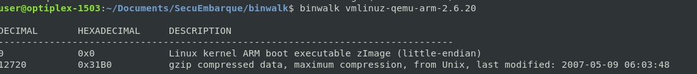
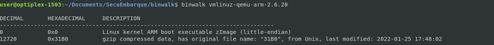

# TD3 Binwalk

## À la recherche de tux
Binwalk est un outil de revers engineering qui nous permet de voir les fichiers dans une image. Ainsi, après avoir démarré la VM la première fois avec qemu, j'utilise binwalk pour afficher le contenu de l'image :
```
user@optiplex-1503:~/Documents/SecuEmbarque/binwalk$ binwalk vmlinuz-qemu-arm-2.6.20 

DECIMAL       HEXADECIMAL     DESCRIPTION
--------------------------------------------------------------------------------
0             0x0             Linux kernel ARM boot executable zImage (little-endian)
12720         0x31B0          gzip compressed data, maximum compression, from Unix, last modified: 2007-05-09 06:03:48

Pour voir le contenu du gzip, j'utilise la fonction dd pour extraire sous forme de gz uniquement les octets à partir de 12720. Je peux alors réutiliser binwalk et ainsi de suite. 
```
Après 3 fois, j'obtiens la localisation de l'image de tux.

```
2984412       0x2D89DC        ASCII cpio archive (SVR4 with no CRC), file name: "/usr/local/share/directfb-examples/tux.png", file name length: "0x0000002B", file size: "0x00006050"
```

## Modification de tux
J'ai ouvert le fichier de tux dans un éditeur d'image et j'ai modifié quelques paramètres comme le contraste. 
Pour tenter de modifier l'affichage de ce pingouin au redémarrage, il me faut maintenant faire les opérations inverses de celles faites pour arriver jusqu'à l'image. C'est-à-dire rezipper les bons éléments et remplacer les bons octets sans détruire les autres.
EAprès plusieurs essais, j'ai trouvé la commande suivante qui me permettait d'extraire plus rapidement.
```
binwalk -e -M -r --directory=. vmlinuz-qemu-arm-2.6.20
```
Voici ensuite les commandes que j'ai utilisées pour faire les "remontages" (évidemment, ça n'a pas été si simple que ce que les commandes ci-dessous le laissent entendre. Il a fallu plusieurs tests et essais) : 
```
cd _vmlinuz-qemu-arm-2.6.20-0.extracted/_31B0.extracted/_E7E0.extracted/cpio-root/
find . | cpio -o -H newc >> ./../../bob.cpio
cd ../../
mv bob.cpio E7E0
cd ..
gzip _31B0.extracted/E7E0
mv E7E0.gz E7E0
dd if=E7E0 of=31B0 bs=1 seek=59360 conv=notrunc
cd ..
gzip 31B0
mv 31B0.gz 31B0
dd if=31B0 of=vmlinuz-qemu-arm-2.6.20 bs=1 seek=12720 conv=notrunc
```

Après comparaisons, l'image de base et l'image recrée sont bien les mêmes quand on les observe avec binwalk (hormis les dates évidemment) : 



Malheureusement, lors du lancement de la VM, j'obtiens le message d'erreur suivant : "Guest has not initialized the display (yet)".

Je pense donc qu'il y a une sécurité : on ne peut pas modifier une partie d'une image comme ça. Les recherches sur le sujet me paraissent infructueuses. De mon point de vue, il s'agit d'une vérification d'intégrité. 

## Contourner cette protection
Pour contourner cette protection, si tant est qu'il s'agit d'un contrôle d'intégrité, il faudrait recalculer le hash de notre image après modifications et remplacer le hash de comparaison dans l'image également. Je n'ai pas trouvé comment faire cette étape. é 


## Propriété de sécurité garantie
Si c'est ce que je pense, il s'agit donc d'un contrôle d'intégrité. Ce qui n'est par contre pas garanti est la confidentialité.

