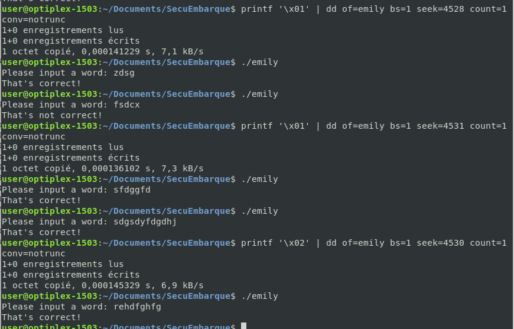

# TD2 Emily

## Découverte
Je copie le code et le compile avec gcc. Je regarde avec hexdump : 
```00000000  7f 45 4c 46 02 01 01 00  00 00 00 00 00 00 00 00  |.ELF............|
00000010  03 00 3e 00 01 00 00 00  a0 10 00 00 00 00 00 00  |..>.............|
00000020  40 00 00 00 00 00 00 00  88 3a 00 00 00 00 00 00  |@........:......|
00000030  00 00 00 00 40 00 38 00  0b 00 40 00 1e 00 1d 00  |....@.8...@.....|
00000040  06 00 00 00 04 00 00 00  40 00 00 00 00 00 00 00  |........@.......|
00000050  40 00 00 00 00 00 00 00  40 00 00 00 00 00 00 00  |@.......@.......|
00000060  68 02 00 00 00 00 00 00  68 02 00 00 00 00 00 00  |h.......h.......|
00000070  08 00 00 00 00 00 00 00  03 00 00 00 04 00 00 00  |................|
00000080  a8 02 00 00 00 00 00 00  a8 02 00 00 00 00 00 00  |................|
00000090  a8 02 00 00 00 00 00 00  1c 00 00 00 00 00 00 00  |................|
000000a0  1c 00 00 00 00 00 00 00  01 00 00 00 00 00 00 00  |................|
000000b0  01 00 00 00 04 00 00 00  00 00 00 00 00 00 00 00  |................|
000000c0  00 00 00 00 00 00 00 00  00 00 00 00 00 00 00 00  |................|
000000d0  a0 06 00 00 00 00 00 00  a0 06 00 00 00 00 00 00  |................|
000000e0  00 10 00 00 00 00 00 00  01 00 00 00 05 00 00 00  |................|
000000f0  00 10 00 00 00 00 00 00  00 10 00 00 00 00 00 00  |................|
00000100  00 10 00 00 00 00 00 00  ad 02 00 00 00 00 00 00  |................|
00000110  ad 02 00 00 00 00 00 00  00 10 00 00 00 00 00 00  |................|
00000120  01 00 00 00 04 00 00 00  00 20 00 00 00 00 00 00  |......... ......|
00000130  00 20 00 00 00 00 00 00  00 20 00 00 00 00 00 00  |. ....... ......|
```

J'essaie la commande gobjdump comme indiqué, mais elle est introuvable. J'utilise objdump que j'ai déjà utilisée auparavant. Je repère la partie .text et je ne garde que les parties liées à mes fonctions is_valid et main.

```
0000000000001185 <is_valid> (Offset dans le fichier : 0x1185):
    1185:       55                      push   %rbp
    1186:       48 89 e5                mov    %rsp,%rbp
    1189:       48 83 ec 10             sub    $0x10,%rsp
    118d:       48 89 7d f8             mov    %rdi,-0x8(%rbp)
    1191:       48 8b 45 f8             mov    -0x8(%rbp),%rax
    1195:       48 8d 35 68 0e 00 00    lea    0xe68(%rip),%rsi        # 2004 <_IO_stdin_used+0x4> (Offset dans le fichier : 0x2004)
    119c:       48 89 c7                mov    %rax,%rdi
    119f:       e8 bc fe ff ff          callq  1060 <strcmp@plt> (Offset dans le fichier : 0x1060)
    11a4:       85 c0                   test   %eax,%eax
    11a6:       75 07                   jne    11af <is_valid+0x2a> (Offset dans le fichier : 0x11af)
    11a8:       b8 01 00 00 00          mov    $0x1,%eax
    11ad:       eb 05                   jmp    11b4 <is_valid+0x2f> (Offset dans le fichier : 0x11b4)
    11af:       b8 00 00 00 00          mov    $0x0,%eax
    11b4:       c9                      leaveq 
    11b5:       c3                      retq   
```
```main():
    11b6:       55                      push   %rbp
    11b7:       48 89 e5                mov    %rsp,%rbp
    11ba:       48 83 ec 10             sub    $0x10,%rsp
    11be:       48 c7 45 f8 00 00 00 00         movq   $0x0,-0x8(%rbp)
    11c6:       bf 00 01 00 00          mov    $0x100,%edi
    11cb:       e8 a0 fe ff ff          callq  1070 <malloc@plt> (Offset dans le fichier : 0x1070)
    11d0:       48 89 45 f8             mov    %rax,-0x8(%rbp)
    11d4:       48 8d 3d 2e 0e 00 00    lea    0xe2e(%rip),%rdi        # 2009 <_IO_stdin_used+0x9> (Offset dans le fichier : 0x2009)
    11db:       b8 00 00 00 00          mov    $0x0,%eax
    11e0:       e8 6b fe ff ff          callq  1050 <printf@plt> (Offset dans le fichier : 0x1050)
    11e5:       48 8b 45 f8             mov    -0x8(%rbp),%rax
    11e9:       48 89 c6                mov    %rax,%rsi
    11ec:       48 8d 3d 2c 0e 00 00    lea    0xe2c(%rip),%rdi        # 201f <_IO_stdin_used+0x1f> (Offset dans le fichier : 0x201f)
    11f3:       b8 00 00 00 00          mov    $0x0,%eax
    11f8:       e8 83 fe ff ff          callq  1080 <__isoc99_scanf@plt> (Offset dans le fichier : 0x1080)
    11fd:       48 8b 45 f8             mov    -0x8(%rbp),%rax
    1201:       48 89 c7                mov    %rax,%rdi
    1204:       e8 7c ff ff ff          callq  1185 <is_valid> (Offset dans le fichier : 0x1185)
    1209:       85 c0                   test   %eax,%eax
    120b:       74 0e                   je     121b <main+0x65> (Offset dans le fichier : 0x121b)
    120d:       48 8d 3d 0e 0e 00 00    lea    0xe0e(%rip),%rdi        # 2022 <_IO_stdin_used+0x22> (Offset dans le fichier : 0x2022)
    1214:       e8 27 fe ff ff          callq  1040 <puts@plt> (Offset dans le fichier : 0x1040)
    1219:       eb 0c                   jmp    1227 <main+0x71> (Offset dans le fichier : 0x1227)
    121b:       48 8d 3d 10 0e 00 00    lea    0xe10(%rip),%rdi        # 2032 <_IO_stdin_used+0x32> (Offset dans le fichier : 0x2032)
    1222:       e8 19 fe ff ff          callq  1040 <puts@plt> (Offset dans le fichier : 0x1040)
    1227:       48 8b 45 f8             mov    -0x8(%rbp),%rax
    122b:       48 89 c7                mov    %rax,%rdi
    122e:       e8 fd fd ff ff          callq  1030 <free@plt> (Offset dans le fichier : 0x1030)
    1233:       b8 00 00 00 00          mov    $0x0,%eax
    1238:       c9                      leaveq 
    1239:       c3                      retq   
    123a:       66 0f 1f 44 00 00       nopw   0x0(%rax,%rax,1)
```

## Cassons le programme
Je remarque mes deux mov dans la fonction is_valid qui correspondent à mes 2 retours. Je cherche dans hexdump où sont ces lignes : 
```
user@optiplex-1503:~/Documents/SecuEmbarque$ hexdump -C emily | less | grep b8
00000140  b8 01 00 00 00 00 00 00  b8 01 00 00 00 00 00 00  |................|
00000300  da 78 b8 f6 99 75 0e b0  02 00 00 00 0b 00 00 00  |.x...u..........|
000011a0  bc fe ff ff 85 c0 75 07  b8 01 00 00 00 eb 05 b8  |......u.........|
000011d0  48 89 45 f8 48 8d 3d 2e  0e 00 00 b8 00 00 00 00  |H.E.H.=.........|
000011f0  0e 00 00 b8 00 00 00 00  e8 83 fe ff ff 48 8b 45  |.............H.E|
00001230  fd ff ff b8 00 00 00 00  c9 c3 66 0f 1f 44 00 00  |..........f..D..|
00002060  b8 00 00 00 58 f0 ff ff  60 00 00 00 3d f1 ff ff  |....X...`...=...|
00003b80  00 00 00 00 00 00 00 00  44 00 00 00 f6 ff ff 6f  |........D......o|
```
Mon b8 intéressant, en comparant aussi avec mon objdump, est à la ligne "000011a0  bc fe ff ff 85 c0 75 07  b8 01 00 00 00 eb 05 b8  |......u.........|". C'est 11a0 + 16 : Je transforme ça en décimal et j'obtiens 4528.

On voit d'ailleurs qu'en mettant le 1 à un autre endroit de la ligne, ou même "autre chose que 0", on obtient le même résultat :). C'est l'interprétation de "true"





