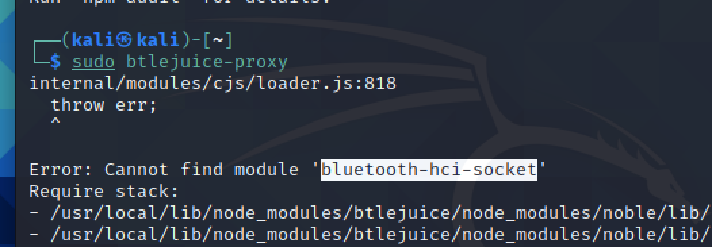

# TD4 Toolbox

## Repo Github

### MITM Bluetooth
J'ai trouvé le repo suivant : https://github.com/DigitalSecurity/btlejuice mais je n'ai pas pu le tester pour deux raisons : 
- Je n'ai pas d'appareil émetteur BLE
- J'ai des erreurs d'installation des libraires node/js (malgré les npm install nécessaires).

### MITM Wifi
J'ai trouvé le repo suivant : https://github.com/wifiphisher/wifiphisher
Il me parait super prometteur et intéressant. Je le teste sur kali linux, comme recommandé. J'ai malheureusement des erreurs car wifiphisher n'arrive pas à trouver de carte wifi. J'ai vu que c'était un souci courant sur les macbook. J'ai suivi plusieurs tutoriels, dont celui-ci : https://pentestmac.wordpress.com/2015/11/28/kali-linux-broadcom-wireless-on-macbook/, mais sans succès. Je n'arrive pas à débloquer la carte wifi...
Il m'a donc été impossible de tester.

### MITM USB
J'ai trouvé le repo suivant : https://github.com/BenGardiner/USBProxy
C'était le plus prometteur, les autres n'avaient pas vraiment de doc : https://github.com/airbus-seclab/usbq_core, https://github.com/withdk/badusb2-mitm-poc

### MITM NFC
J'ai trouvé le repo suivant : https://github.com/nfcgate/nfcgate
Impossible cependant de tester.

### MITM RJ45
Ce projet me parait très intéressant : https://github.com/unknwncharlie/Int3rcept0r mais je n'ai pas le matériel.

### MITM Hardware
Je ne suis pas sûr de bien comprendre... Un MITM sur une carte mère ? En tout cas, il y a une cheatsheet ici intéressante : https://github.com/frostbits-security/MITM-cheatsheet

## Quel sont les critères qui rendent une vulnérabilité critique ?
D'après le CVSS, 3 métriques sont utilisées pour classer les vulnérabilités. Chaque métrique apporte des points. 
Par exemple, si une attaque peut être menée à distance, elle rapporte 1 point sur 10. Tandis qu'une attaque qui ne peut être menée que localement rapporte 0.395 points.
Il en va de même pour la configuration du système attaquable : s'il faut une configuration très particulière pour que l'attaque soit possible, alors il y a moins de points apportés que si l'attaque est réalisable quelque soit la configuration.
Pareil pour le besoin d'authentification, si l'attaque impacte la confidentialité, la disponibilité ou l'intégrité d'un système.
Finalement, une vulnérabilité critique est une vulnérabilité exploitable à distance sur de nombreux systèmes sans configuration particulières, sans besoin d'authentification, qui met en péril la confidentialité, l'intégrité ou la disponibilité d'un système. 

## Suivant ces critères quelle interface devrait être testée en premier ? Pourquoi?
Étant donné qu'une vulnérabilité est critique si elle est exploitable à distance, on peut imaginer qu'il s'agit d'une interface réseau. Avec la multiplication des appareils IoT, le Wifi, l'éthernet ou le bluetooth semblent des interfaces intéressantes.

