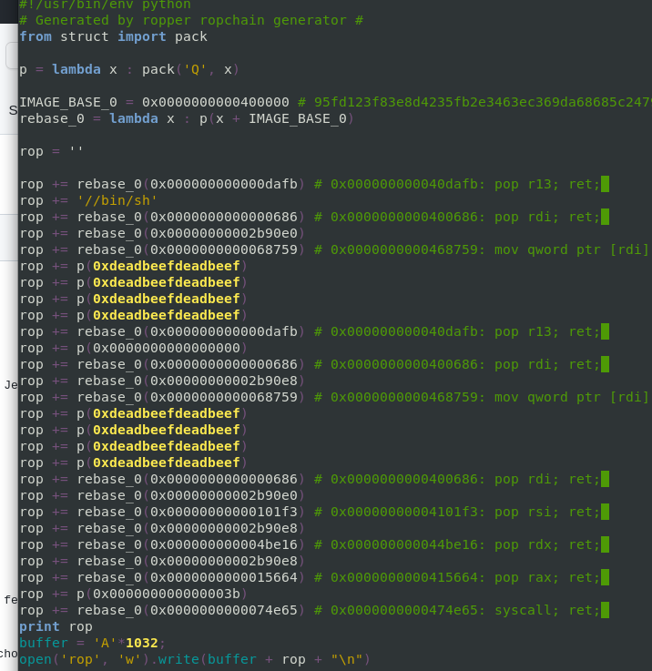
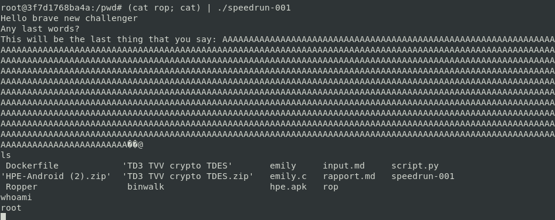

# TD3 Speedrun

## Devenir root
Je suis le tutoriel et je deviens root : 

En tant que root, je peux tout faire : par exemple, je peux voler des informations (comme des idents, des clés privées...), surveiller un système...

## Modèle d'attaque
En suivant la cyber killchain, il faut d'abord analyser le programme, son comportement et récupérer le maximum d'informations dessus. Par exemple, quel type de fichier est-ce, date de création, reverse engineering etc. On essaie de déduire la surface d'attaque et la criticité par exemple. 
Ensuite, nous pouvons réfléchir au payload, l'exploiter et enfin obtenir les résultats souhaités. 

## Use after free
S'il a été possible d'arriver à notre fin, c'est qu'il y avait un "bug" dans le programme. Très certainement un scanf mal programmé sans vérification de taille, un un problème de gestion de buffer. Malgré les règles de compilation et les protections appliquées (NX), à cause de ce défaut de programmation, il est possible d'exploiter le programme de manière peu éthique. 
Dans le cas d'un use after free, je ne pense pas que l'on puisse utiliser cette méthode. En effet, le use after free permet de manipuler la heap, alors que le rop abuse la stack.

## Contre les bugs
Plusieurs "techniques" existent pour limiter les bugs et les failles de sécurité. On peut faire de la review de code, utiliser des systèmes de détection de failles (comme Blackfire pour PHP), tester le code à chaque déploiement, utiliser des outils de tests dédiés comme Frama-C (que l'on a utilisé en 4A !). 

## Bonus
Bonus: Quelle différence si les canary et l'ASLR sont présents?
Si ASRL est présent, cela ne gêne pas l'utilisation de notre ROP Chain. En effet, on ne se base sur la libc, mais sur des gadgets présents dans les parties exécutables de notre binaire : on n'est donc pas sensible aux changements d'adresses constants des librairies. 
COncernant les canary, j'ai mis plus de temps à trouver et ne suis pas sûr de ma réponse... mais d'après ce post : https://hackingiscool.pl/stack-canary-rop-format-string-leak-also-how-i-learned-nullbyte-is-not-a-badchar-to-scanf-string/, il est possible, dans certains cas, de faire marcher une ropchain malgré la présence des canary
